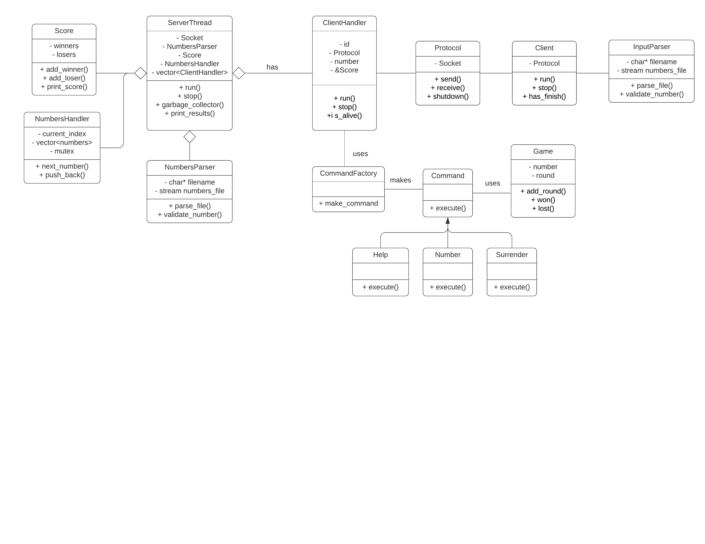

# TP3 - Guess the number - Taller de Programacion
Alumno: Tomas Szemzo - Padrón: 97771

Link al Repositorio: https://github.com/tszemzo/multiclient-guess-the-number-tp3

## Resolución del Trabajo
 
En primer lugar, voy a incluir un UML con el modelo utilizado para la solución.
 
 **UML:**

La arquitectura del trabajo cliente-servidor que esta implementada en base a hilos (std::threads) se estructura de la siguiente manera:

* <ins>**Serverside:**</ins> desde el main invocamos a nuestro hilo ServerThread que sera el "orquestrador" de los hilos clientes. Como se trata de un juego multicliente debemos permitir que varios jugadores en simultaneo puedan jugar. Es por esto que existe la entidad ClientHandler (que tambien es un hilo de ejecucion) y por cada cliente mantendremos un ClientHandler que a partir de clases como Game, Commands (Help, Surrender, Number) tendran la logica serverside del juego. Otro desafio no menor para la realizacion del trabajo fue la "salida limpia" del mismo ya sea por parte de algun cliente que termino su partida, o la salida total del server que es cuando ingresamos una 'q' por stdin. Aqui la estrategia que se tomo basicamente es que como cada ClientHandler que representa a un hilo del cliente fue almacenado previamente en un vector cuando fue creado. Entonces, cuando cerramos el servidor, debemos iterar por este vector cerrando los sockets de cada cliente, y luego eliminarlos de este vector. Por ultimo, no es menor mencionar que para no tener "leaks" de memoria con clientes que estan muertos pero que siguen estando en memoria, como el servidor esta pensado para estar ejecutandose mucho tiempo, por cada iteracion del ServerThread realizamos un garbage_collector. En que se basa esto? Basicamente, recorremos nuestro vector de clientes y si alguno no se encuentra vivo, lo eliminamos del vector para no mantenerlo. Eso nos permite escalar sin consumir toda la memoria y como mencione previamente, teniendo en cuenta que el servidor no esta pensado para cortarse seguido.

* <ins>**Clientside:**</ins> aqui no hay nada muy raro, el cliente no esta implementado con theads, aunque si posee al protocolo con el cual establece la comunicacion con el servidor mediante sockets, como ya vimos en la materia.

* <ins>**Protocolo:**</ins> como fue establecido para el trabajo, el protocolo envia comandos, strings y tamaños de cada string en formato big endian siempre y lo hace a traves de sockets.

Con respecto al diseño e implementacion, el TP fue realizado en primer lugar con la arquitectura de cliente servidor pero sin threads para no complejizar la logica del modelo. Se realizo el desarrollo iterativamente del modelo, que posee parsers, un protocolo y comandos de forma polimorfica. Me parece que es mas relevante en este punto detenerse mas en el diagrama UML realizado.

Por ultimo, queria mencionar que fue necesario el uso de elementos de sincronizacion como lo son los mutex para el recurso compartido del Score o tanteador del juego, en donde cada client handler sumara un ganador o perdedor. Y tambien en el manejador o handler de los numeros a adivinar en el servido, que tambien seran consumidos por los client handlers cuando comienzan cada partida.
